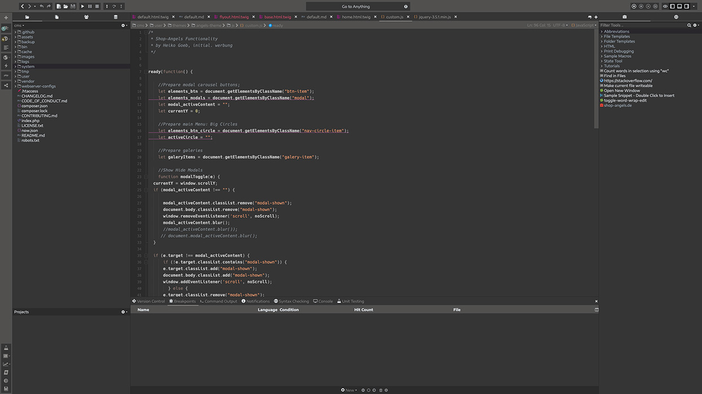

# dq-autumnomy
Komodo IDE Color Scheme: Dark Warm Gray inspired by autumn colors

### Important Note ! ###
I have developed the color scheme with the following fonts
* Hack (for editor)
* Encode Sans (for Interface and Widgets)

You may want to install them first.
You can alway overwrite my font setting with your personal preferences.

# Screenshot JS

